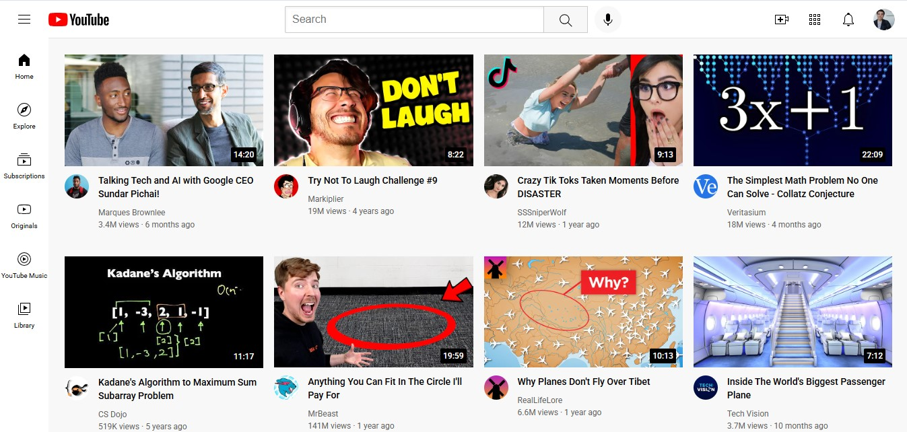

# YouTube Clone 🎬

Este é um projeto de **clone do YouTube**, desenvolvido para fins educacionais, com o objetivo de replicar a interface e funcionalidades principais do YouTube. O projeto foi feito utilizando **HTML** e **CSS**, com foco na construção de uma interface intuitiva e responsiva.

## Funcionalidades 🌟

- **Página inicial**: Exibe uma lista de vídeos, com títulos, miniaturas (thumbnails) e descrições.
- **Barra de navegação**: Permite navegação entre diferentes seções do site (ex: Início, Trending, Inscrições).
- **Pesquisa** 🔍: Função básica de pesquisa para buscar vídeos.
- **Thumbnails** 📸: Exibição das miniaturas dos vídeos (sem o player de vídeo).
- **Responsividade** 📱: Design adaptável a diferentes tamanhos de tela.

---

## Print da tela 📸

Aqui está um print da interface do projeto:



---

## Tecnologias Utilizadas 🛠️

- **HTML5**: Estruturação do conteúdo e layout da página.
- **CSS3**: Estilização e responsividade do layout.

## Visualize o Projeto ao Vivo 🚀

Você pode visualizar o projeto ao vivo clicando no link abaixo:

[**YouTube Clone**](https://tobias-youtube-clone.netlify.app/)

## Como Rodar o Projeto 🚀

1. **Clone o repositório** para sua máquina:
   ```bash
   git clone https://github.com/tobiasprandini/YouTube-Clone.git
